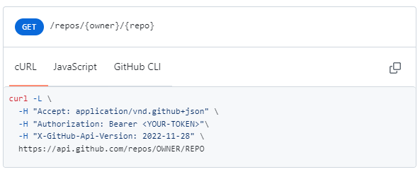
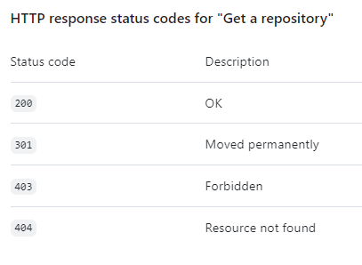

### Instruction
It was needed to include github app(user) authentication in request. Github offers various methods of authorization (token generation) but for the sake of simplifying the project I decided to use a personal token (personal token).

>*IMPORTANT*  
>To run the application, it is necessary to pass the token in the launch command.

Run with maven standard commands:

- ``mvn spring-boot:run '-Dspring-boot.run.arguments=INSERT_TOKEN_HERE'`` to start application

- ``mvn test '-Dspring-boot.run.arguments=INSERT_TOKEN_HERE'`` for performing tests

- ``mvn package '-Dspring-boot.run.arguments=INSERT_TOKEN_HERE'`` for building jar file

This was done in such a way that sensitive data such as a token are not kept anywhere permanently for security reasons.
And for this reason, the token generated by me, which can be used to check the application, will be sent by e-mail. It is also possible to generate your own token here: https://github.com/settings/tokens

I considered using some mapper (e.g. dozer) but for mapping one class I preferred to use @jsonproperty annotation.

I got information about the API from:
https://docs.github.com/en/rest/repos/repos?apiVersion=2022-11-28

Info about request:

Info about possible response statuses:

